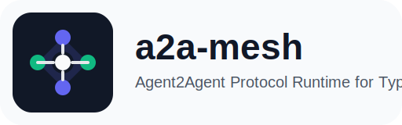
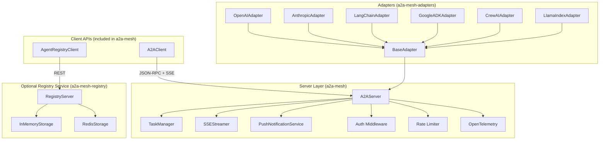

<div align="center">
  
  <h1>a2a-mesh</h1>
  <p><strong>Production-ready TypeScript runtime for Google's Agent2Agent (A2A) Protocol v1.0</strong></p>
  <p>Server runtime · Client APIs · Multi-framework adapters · Optional registry · CLI</p>
</div>

<p align="center">
  <a href="https://oaslananka.github.io/a2a-mesh"></a>
  <a href="https://www.npmjs.com/package/a2a-mesh"></a>
  <a href="https://www.npmjs.com/package/a2a-mesh"></a>
  <a href="https://dev.azure.com/oaslananka/open-source/_build"></a>
  <a href="./vitest.config.ts"></a>
  <a href="./LICENSE"></a>
  <a href="https://www.typescriptlang.org/"></a>
  <a href="./package.json"></a>
  <a href="https://google.github.io/A2A"></a>
</p>

`a2a-mesh` is a TypeScript-first toolkit for building interoperable A2A agents with production ergonomics out of the box: protocol-complete server runtime, client SDK, framework adapters, registry APIs, streaming, auth, telemetry, storage, and CLI tooling.

The project is published publicly on GitHub and can also be mirrored to GitLab for backup or alternate workflow setups.

## Why a2a-mesh?

| Feature                        | a2a-mesh | Raw fetch | Other libs |
| ------------------------------ | -------- | --------- | ---------- |
| A2A Protocol v1.0 compliance   | ✅ Full  | ❌ Manual | ⚠️ Partial |
| Push notifications (webhook)   | ✅       | ❌        | ❌         |
| Extension negotiation          | ✅       | ❌        | ❌         |
| Multi-framework adapters       | ✅ 6+    | ❌        | ⚠️ 1-2     |
| Agent registry & discovery     | ✅       | ❌        | ❌         |
| JWT / OIDC auth built-in       | ✅       | ❌        | ❌         |
| OpenTelemetry spans            | ✅       | ❌        | ❌         |
| CLI tooling                    | ✅       | ❌        | ❌         |
| gRPC transport                 | ✅       | ❌        | ❌         |
| TypeScript-first, dual ESM/CJS | ✅       | N/A       | ⚠️         |

## Architecture



## Public Packages

| Package              | Purpose                                                                  |
| -------------------- | ------------------------------------------------------------------------ |
| `a2a-mesh`     | Main package: server runtime, A2A client APIs, auth, middleware, telemetry, and storage |
| `a2a-mesh-adapters` | OpenAI, Anthropic, LangChain, Google ADK, CrewAI and LlamaIndex adapters |
| `a2a-mesh-registry` | Optional registry service, storage backends, SSE updates and metrics     |
| `a2a-mesh-cli`      | `a2a` binary for validation, discovery, monitoring and scaffolding       |
| `create-a2a-mesh`   | `npx` bootstrap wrapper for generating a new agent project               |

Most users only need `a2a-mesh`.

Add `a2a-mesh-adapters` when you want provider integrations, `a2a-mesh-cli` for the command line, and
`a2a-mesh-registry` only when you need a dedicated shared registry service.

The monorepo still contains internal or advanced companion packages for testing, transports, and ecosystem
bridges, but the public install story stays intentionally small.

## Quick Start

```bash
npm install a2a-mesh a2a-mesh-adapters
```

```ts
import { BaseAdapter } from 'a2a-mesh-adapters';
import type { Artifact, Message, Task } from 'a2a-mesh';

class EchoAgent extends BaseAdapter {
  async handleTask(_task: Task, message: Message): Promise<Artifact[]> {
    const text = message.parts.find((part) => part.type === 'text');
    return [
      {
        artifactId: 'echo-1',
        parts: [{ type: 'text', text: text?.type === 'text' ? text.text : 'empty' }],
        index: 0,
        lastChunk: true,
      },
    ];
  }
}

const agent = new EchoAgent({
  protocolVersion: '1.0',
  name: 'Echo Agent',
  description: 'Minimal A2A echo agent',
  url: 'http://localhost:3000',
  version: '1.0.0',
  capabilities: {
    streaming: true,
    pushNotifications: true,
    stateTransitionHistory: true,
  },
  defaultInputModes: ['text'],
  defaultOutputModes: ['text'],
  securitySchemes: [],
});

agent.start(3000);
```

```ts
import { A2AClient } from 'a2a-mesh';

const client = new A2AClient('http://localhost:3000');
const task = await client.sendMessage({
  message: {
    role: 'user',
    parts: [{ type: 'text', text: 'Summarize the latest meeting.' }],
    messageId: crypto.randomUUID(),
    timestamp: new Date().toISOString(),
  },
  contextId: 'planning-session',
});

console.log(task.status.state);
```

## CLI

```bash
npx a2a discover http://localhost:3000
npx a2a validate http://localhost:3000
npx a2a task send http://localhost:3000 "Summarize the latest meeting"
npx a2a monitor http://localhost:3000
npx a2a benchmark http://localhost:3000 --requests 20 --concurrency 5
npx a2a export-card http://localhost:3000 --output agent-card.json
npx a2a registry start --port 3099
```

## Docs

📚 **[https://oaslananka.github.io/a2a-mesh](https://oaslananka.github.io/a2a-mesh)**

- [Getting Started](https://oaslananka.github.io/a2a-mesh/guide/quick-start)
- [Adapters](https://oaslananka.github.io/a2a-mesh/packages/adapters)
- [Registry UI](https://oaslananka.github.io/a2a-mesh/packages/registry-ui)
- [API Reference](https://oaslananka.github.io/a2a-mesh/api/core)
- [Protocol compliance](./docs/protocol-compliance.md)
- [Authentication](./docs/authentication.md)
- [Extensions](./docs/extensions.md)
- [Observability](./docs/observability.md)
- [Migration guide](./MIGRATION.md)
- [Contributing](./CONTRIBUTING.md)
- [Roadmap](./.github/ROADMAP.md)

Docs are published via GitHub Pages at `https://oaslananka.github.io/a2a-mesh`.

## Development

```bash
npm install
npm run lint
npm run typecheck
npm run build
npm run test
npm run test:coverage
```

## Community

- Report bugs and request features through GitHub Issues.
- Use GitHub Discussions for questions, RFCs and adapter requests.
- Review [SECURITY.md](./.github/SECURITY.md) before reporting vulnerabilities.
- See [GOVERNANCE.md](./.github/GOVERNANCE.md) for release and decision-making rules.
- Optional GitLab mirror: `https://gitlab.com/oaslananka/a2a-mesh`
